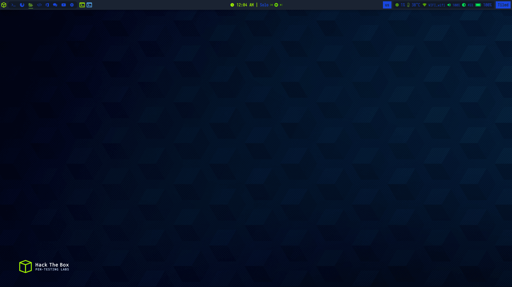

<!-- LOGO -->

  </a>

 

<!-- LOGO -->

<!-- shields -->

  
  
  
  
  

<!-- shields -->

<!-- distro description -->

<h3 align="center">Exodia is a linux distro based on <a href="https://www.archlinux.org">Arch Linux</a>   It will come with <a href="#available-editions">4 editions</a> and more editions will be added </h3>

<!-- distro description -->

<!-- distro demo -->

 

 

<!-- distro demo -->

<!-- Available Editions -->

## Available Editions

### All Editions are under development, comes with [13 themes](#available-themes), You can use our dotfiles until the first release is published

- [**`Puer Editions`**](https://github.com/Exodia-OS/exodia-pure)
- [**`Home Editions`**](https://github.com/Exodia-OS/exodia-home-ISO)
- [**`Wireless Editions`**](https://github.com/Exodia-OS/exodia-wireless)
- [**`Predator Editions`**](https://github.com/Exodia-OS/bspwm-Predator)

<!-- Available Editions -->

<!-- Available Themes Previews -->

   
<h2>Available Themes</h2>

 

|Red Jungles|Emilia|Chad WM|
|--|--|--|
|  |  |  |

|Hack|Red and Black|Rick|
|--|--|--|
|  |  |  |

|Hack The Box|BlackArch|Neon|
|--|--|--|
|  |  |  |

|JS coffee|Amarena|
|--|--|
|  |  |

|JapaneseCity|VALORANT|
|--|--|
|  |  |

<!-- Available Themes Previews -->
